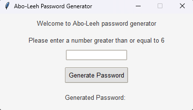
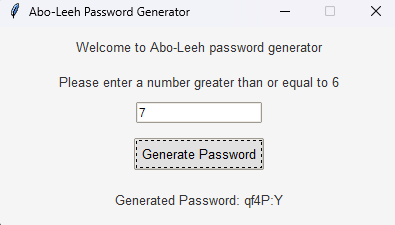

# Random Password Generator 
this is a simple python program that generates random passwords with 6 characters atleast for the user

# Installation 
- first you have to clone this repo using this command in your terminal :
```
git clone https://github.com/youssefkhalil320/Random_Password_Generator-by-Python
```
- then you will have to write this script in your terminal to change directories  :
```
cd Random_Password_Generator-by-Python
```
- now you can run the python files in your terminal

# Usage 
- after running the GUI.py file you are presented with this tkinter window where you will be <br> prompted to input the given password length :<br/>
<br><br/>
- after inputting a number greater than or equal than 6, the program will generate the random password <br>with different symbols and characters alike for the user :<br/>
<br><br/>

